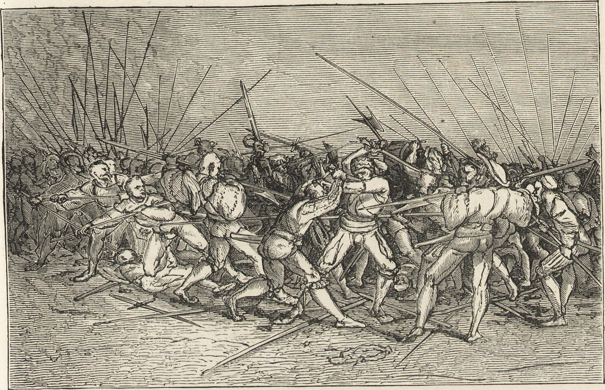
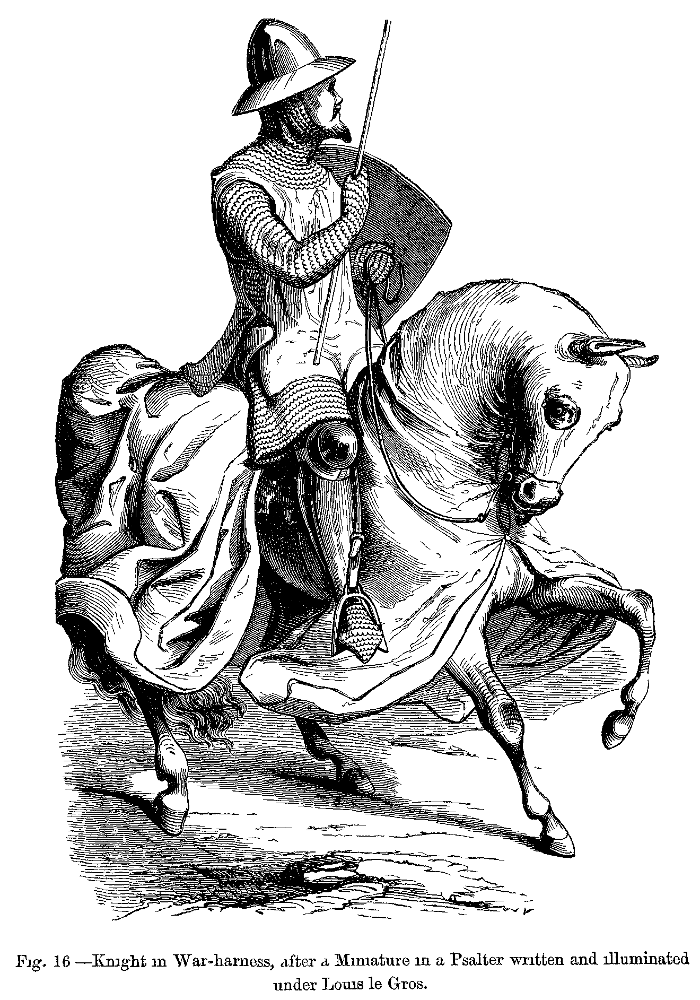

## *Preface*

The words after aren't mine. I am using this as a reference for my players in our upcoming open table campaign Strike the Southern Sky!

I spoke to him and got his permission to post these writings for as long as I credit him with the following phrase: *words based on Chasing a Blaze in the Northern Sky.*

---



# Fighter

## On Warbands

Those intimately familiar with violence knows that it is waged as war, not sport. One unsure of their own victory would not initiate, only engaging in bloodshed when their success would be know through leveraged advantage. A battle fled from, is not a battle lost, it is instead a battle postponed. Those who would present their foes with reason to depart from conflict, would find them to be foes no longer. In some circumstances, the only argument a foe would heed would be the corpses of their companions or their own demise.

One would be able to forecast victory or defeat between to warbands by the following five considerations: First, which warband is favored by the gods, granting them surprise over the other. Second, which warchief has the most cunning, better able to overcome imposed disadvantage. Third, with whom lie the advantages derived from heaven and earth, granting many boons and banes. Fourth, which warband is stronger, considered both in quantity and quality. Fifth, which warband has greater morale, better able to brave death.

## On Leadership and Mercenaries

It is no small thing to risk life and limb, men are kept loyal by fortune and comforts. In their absence loyalty quickly erodes. Hired men are eager to declare their woes, their leaders would be wise to listen. Leaders who risk their subordinates through their own cowardice, inspire no confidence. Leaders who inflict harsh conditions or cruelty on their men risk desertion. Leaders who break promises or withhold pay risk mutiny. 

A man who hires other into his service is responsible for their safety. Men are paid prior to the start of their service, their leader covering food and shelter. Men who take up the offer to perform violence are provided arms and armor by their leaders while veteran mercenaries come prepared and armed at a higher price. Upon victory, men are given a share of spoils by their leader, those leading a charge or demonstrating exceptional valor are given a double-portion. Spoil are still owed to those who fall in battle, their share of the spoils giving to their surviving family, or buried with them. 

## On Equine Matters

Horses are skittish beasts, as they do not speak with the tongue of men, they cannot clarify if they hear wolves or the wind. Further they eat twice as much as men and drink four-fold. These things said, a man riding upon a horse against his foes is a fearsome sight. His steed gallops faster than a man runs and grants him an advantaged position from which to strike down his foes. 
